# Elite Portfolio — Islam El-Nashar

[](https://github.com/aslamalkarywk7/islam-elite-portfolio/actions/workflows/ci.yml)


One gallery showcasing **18 real web projects** — each opens **inside the site** with one click. No downloads, no 404s: every `/live/*` route is served, with a branded fallback preview for any missing path.

**Full Stack • Egypt • aslamalkarywka@gmail.com • https://github.com/aslamalkarywk7**

## 🖼️ Gallery

| # | Project | Stack | Cover | Live |
|---|---------|-------|-------|------|
| 1 | Aetheria — Glassmorphism 2.0 | Vite • React 19 • Tailwind 4 | 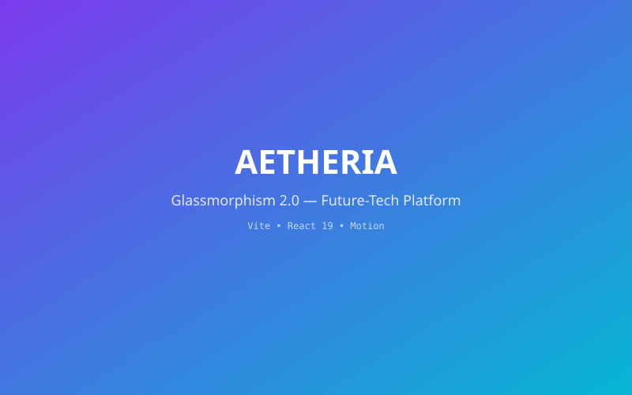 | [live/aetheria---glassmorphism-2.0-platform/](live/aetheria---glassmorphism-2.0-platform/) |
| 2 | Analog Antiques | Vite • React 19 | 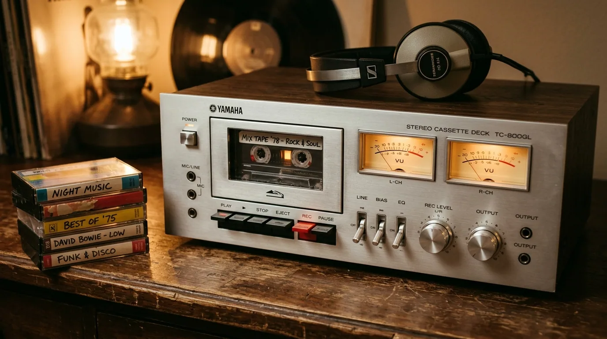 | [live/analog-antiques/](live/analog-antiques/) |
| 3 | Arab Chat Platform (شات العرب) | Next.js • Tailwind 4 | 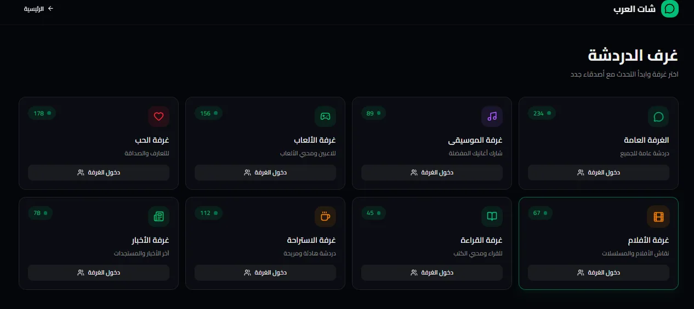 | [live/arabic-chat-ui-ux-design-website/](live/arabic-chat-ui-ux-design-website/) |
| 4 | Audio Engine Pro | Vite • React 19 | 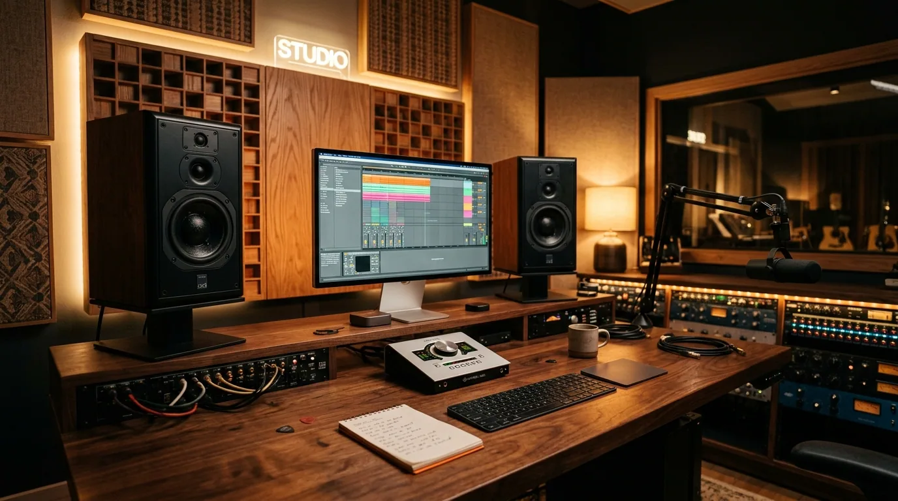 | [live/audio-engine-pro/](live/audio-engine-pro/) |
| 5 | BAUHAUS 1919 | Vite • React 19 | 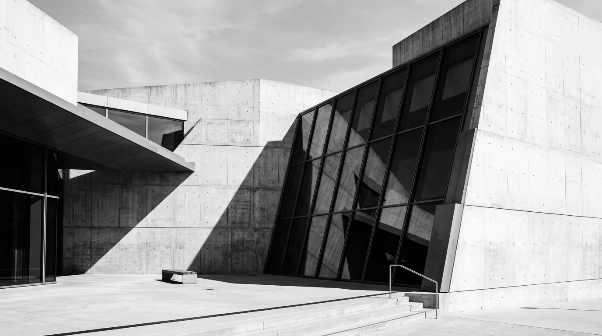 | [live/bauhaus-1919---creative-design-studio-1-/](live/bauhaus-1919---creative-design-studio-1-/) |
| 6 | Elite Medical Clinics (عيادات النخبة) | Next.js |  | [live/clinics-portfolio-design/](live/clinics-portfolio-design/) |
| 7 | Oman Luxury Dash | Next.js • Recharts |  | [live/dashboard-website/](live/dashboard-website/) |
| 8 | Atrium — Industrial OS | Next.js | 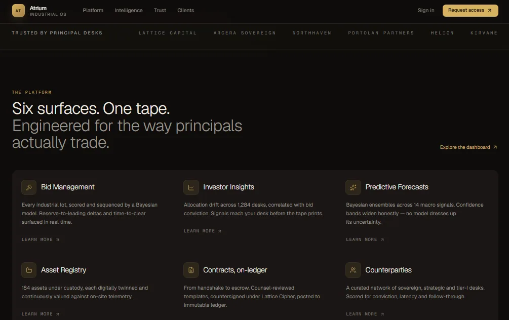 | [live/design-dashboard-pro/](live/design-dashboard-pro/) |
| 9 | Connective Agency | Vite • React 19 | 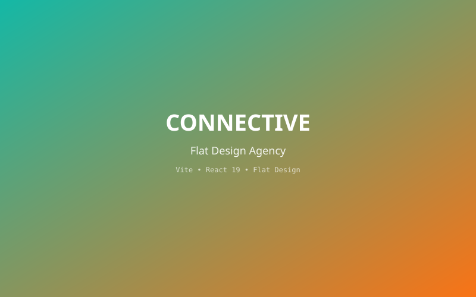 | [live/flat-design-website/](live/flat-design-website/) |
| 10 | GRID STUDIO — Swiss System | Vite • React 19 |  | [live/grid-studio---swiss-design-system/](live/grid-studio---swiss-design-system/) |
| 11 | Ajmas — Industrial Marketplace (أجماس) | Next.js • Radix UI | 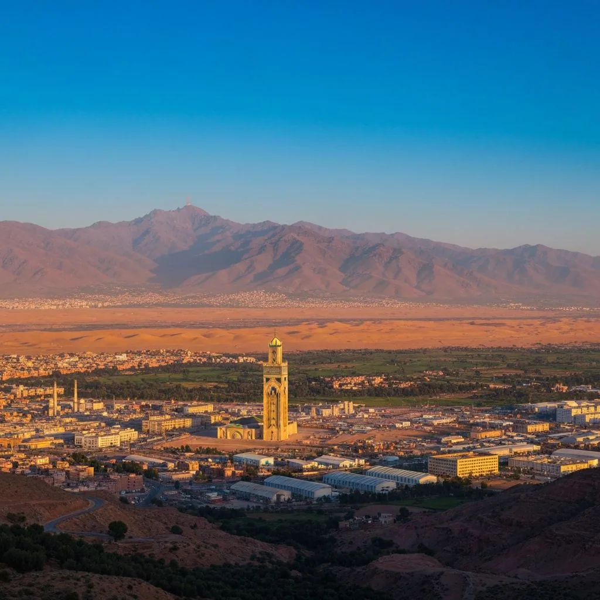 | [live/industrial-marketplace-platform/](live/industrial-marketplace-platform/) |
| 12 | MAISON NOIR | Vite • React 19 | 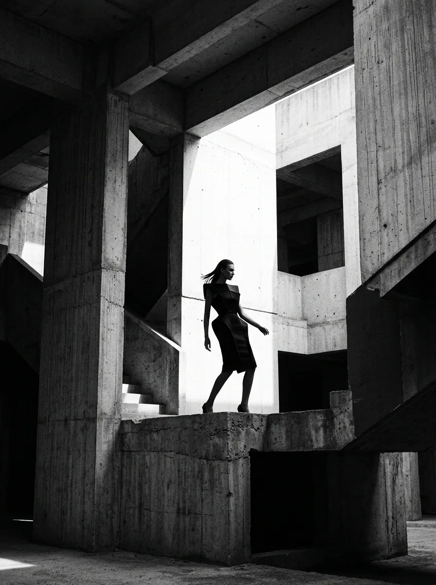 | [live/luxury-creative-agency/](live/luxury-creative-agency/) |
| 13 | Previous Portfolio (معرض أعمالي) | HTML • CSS • JS | 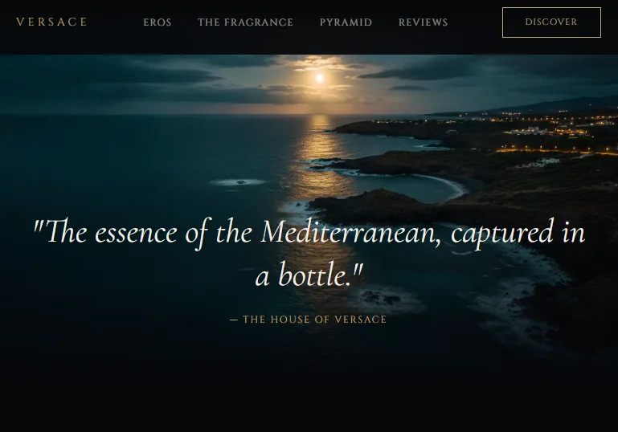 | [live/mywebsite/](live/mywebsite/) |
| 14 | Horror Gallery (معرض الرعب) | HTML • GSAP | 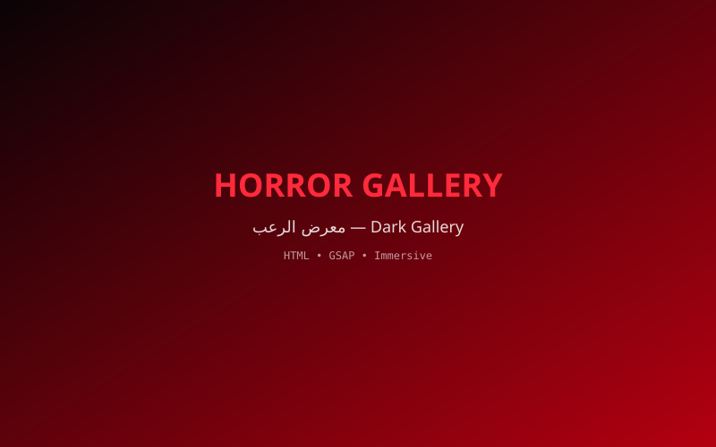 | [live/platform_horror/](live/platform_horror/) |
| 15 | RAW Brutalist Studio | Vite • React 19 | 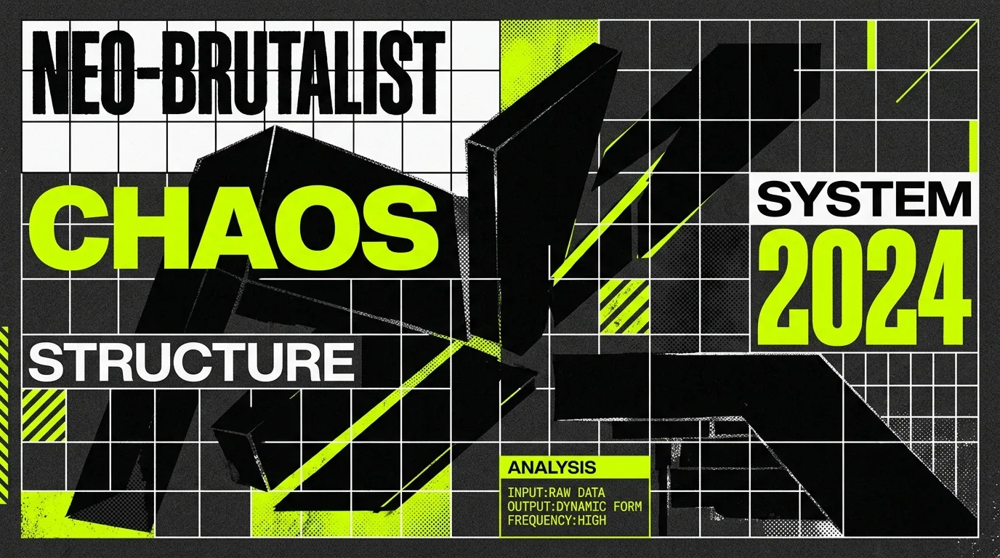 | [live/raw-brutalist-creative-studio/](live/raw-brutalist-creative-studio/) |
| 16 | RetroWave Studio | Vite • React 19 | 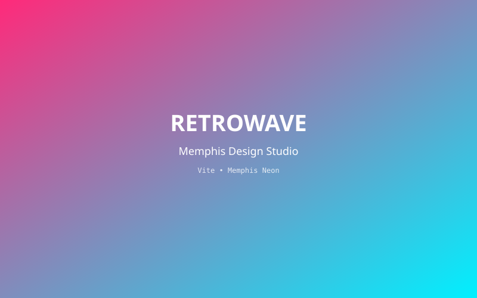 | [live/retrowave-studio/](live/retrowave-studio/) |
| 17 | Studio Chroma | Vite • React 19 | 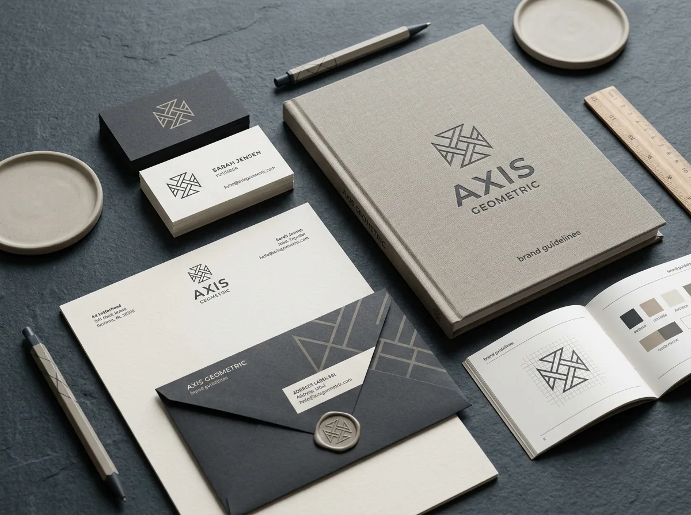 | [live/studio-chroma/](live/studio-chroma/) |
| 18 | Zenith Finance | Vite • React 19 | 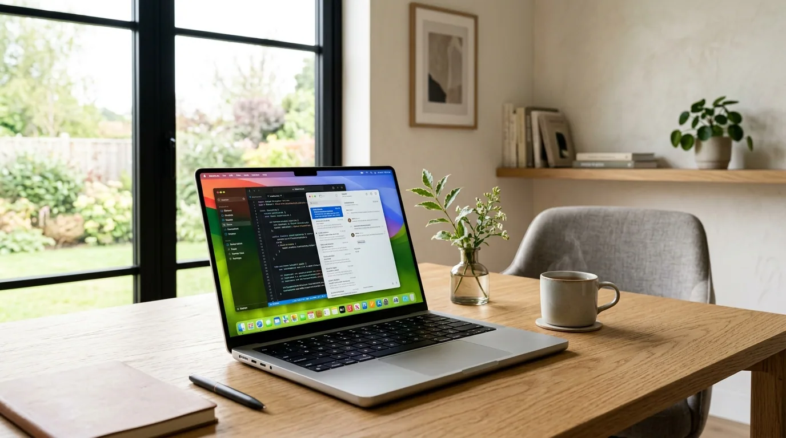 | [live/zenith-finance/](live/zenith-finance/) |

> Per-project write-ups live in [`docs/`](docs/) (one folder per project).

## ▶️ Run

```bash
npm install
npm run dev     # http://localhost:3000
```

Static hosting works too (see [`vercel.json`](vercel.json) — output directory is `.`):
any static server serving the repo root exposes the gallery at `/` and demos at `/live/<project>/`.

## 🧰 Scripts

| Command | What it does |
|---|---|
| `npm run dev` / `start` / `serve` | Serve the gallery + all live demos (Express, [`server.js`](server.js)) |
| `npm run optimize:images` | Reproducible WebP pipeline for showcase assets ([`scripts/optimize-images.mjs`](scripts/optimize-images.mjs)) |
| `npm run validate` / `npm test` | Asset-reference + naming + budget guard ([`scripts/validate-assets.mjs`](scripts/validate-assets.mjs)) — also runs in CI |

## 📂 Structure

```
islam-elite-portfolio/
├── index.html / style.css / script.js   ← gallery shell (reads projects.json)
├── projects.json                        ← control file: covers, screenshots, docs, live paths
├── covers/                              ← 18 project covers (WebP/SVG)
├── images/<project>/                    ← per-project screenshots (WebP)
├── assets/ / icon/                      ← personal + brand assets
├── live/<project>/                      ← 18 self-contained runnable demos
├── docs/<project>/                      ← per-project write-ups + ARCHITECTURE/ASSETS/PERFORMANCE
├── scripts/                             ← optimize-images, validate-assets (+ allowlist)
├── .github/workflows/ci.yml             ← install + validate on push/PR
├── server.js / vercel.json / START.bat
└── LICENSE (MIT)
```

## 📐 Conventions

- **File names:** ASCII lowercase kebab-case, no spaces — enforced by `npm test` (see [`docs/ASSETS.md`](docs/ASSETS.md)).
- **Images:** WebP (q82, max 1600px) for showcase assets; build output under `live/` is untouched.
- **Docs:** every project links its write-up via `projects.json → docs`.

## ⚡ Performance

Tracked size **51.6MB → ~21MB** after the WebP migration (showcase images 38.8MB → ~7MB).
Details + known upstream export gaps: [`docs/PERFORMANCE.md`](docs/PERFORMANCE.md).

## 🤝 Contributions & License

Linked profile: https://aslamalkarywk7.github.io/aslamalkarywk7 — MIT, see [LICENSE](LICENSE).
